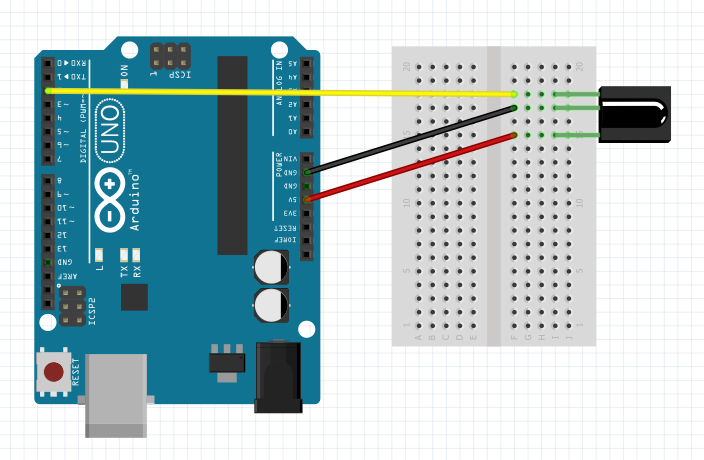

## Arduino Remote scanner

There is very nice tutorial which covers also theory about modulationi and other interesting things: http://www.instructables.com/id/How-To-Useemulate-remotes-with-Arduino-and-Raspber/ . If you want to scan your remote controller right away just use `src/arduino/arduino-remote-scanner-extended.c` which is based on [z3t0's](https://github.com/z3t0/Arduino-IRremote/blob/master/examples/IRrecvDump/IRrecvDump.ino) work (kudos to him for putting this together)!

### Schema


### Example

Output can be like this and important is the code and encoding:
```
Encoding  : SAMSUNG
Code      : 707028D7 (32 bits)
Timing[67]:
     +4450, -4450     + 550, - 600     + 500, -1750     + 500, -1650
     + 550, -1750     + 500, - 600     + 500, - 600     + 500, - 600
     + 550, - 600     + 500, - 600     + 500, -1700     + 550, -1700
     + 500, -1700     + 550, - 550     + 550, - 600     + 500, - 600
     + 500, - 600     + 550, - 550     + 550, - 600     + 500, -1700
     + 550, - 550     + 550, -1650     + 550, - 600     + 500, - 600
     + 550, - 600     + 500, -1700     + 500, -1750     + 500, - 600
     + 500, -1750     + 500, - 600     + 500, -1700     + 550, -1700
     + 500, -1700     + 500
unsigned int  rawData[67] = {4450,4450, 550,600, 500,1750, 500,1650, 550,1750, 500,600, 500,600, 500,600, 550,600, 500,600, 500,1700, 550,1700, 500,1700, 550,550, 550,600, 500,600, 500,600, 550,550, 550,600, 500,1700, 550,550, 550,1650, 550,600, 500,600, 550,600, 500,1700, 500,1750, 500,600, 500,1750, 500,600, 500,1700, 550,1700, 500,1700, 500};  // SAMSUNG 707028D7
unsigned int  data = 0x707028D7;
```
