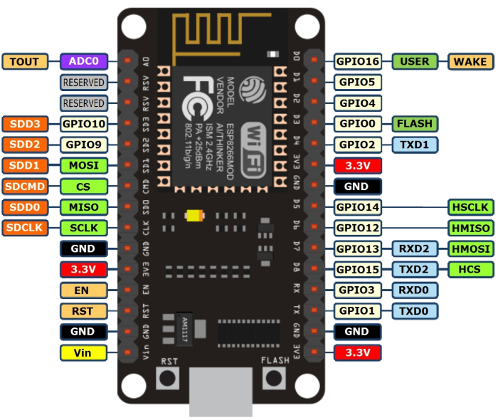

## ESP Led strips

Control LED strips remotely with NodeMCU v3. It runs simple webserver and provides very simple API for setting/retrieving colors so you can easily use it from command line like this:
```
$ curl -s 'http://esp-ledstrip.example.com/?action=set&r=255&g=0&b=100&w=10' | python -m json.tool
{
    "color": "OK",
    "response": "Color rgbw(255,0,100,10) has been set"
}

$ curl -s http://esp-ledstrip.example.com/?action=get | python -m json.tool
{
    "color": "OK",
    "response": {
        "b": 100,
        "g": 0,
        "r": 255,
        "w": 10
    }
}

```

It also comes with bundled WebUI (colorpicker) so controling your LED strips is even easier (see below for example).

### NodeMCU v3 pinout


### Schema
Schema is based on this tutorial: https://learn.adafruit.com/rgb-led-strips/usage


### WebUI
It is located in `src/webui` directory. For using just edit the remote server variable and deploy it on some webserver.


