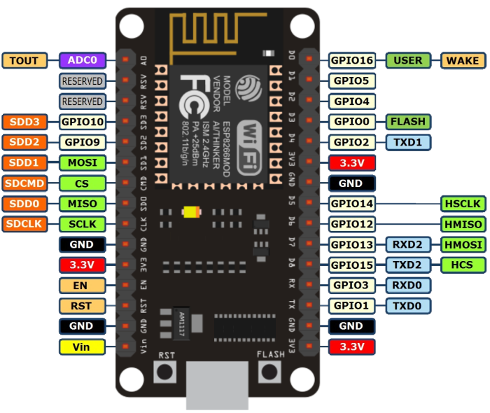
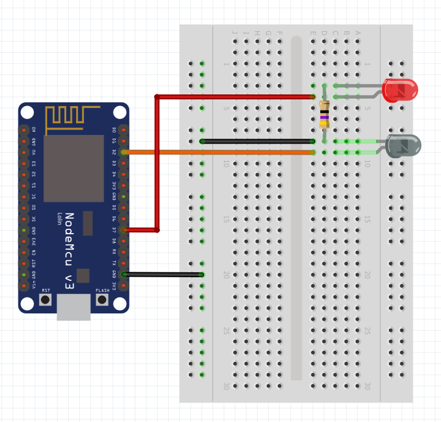
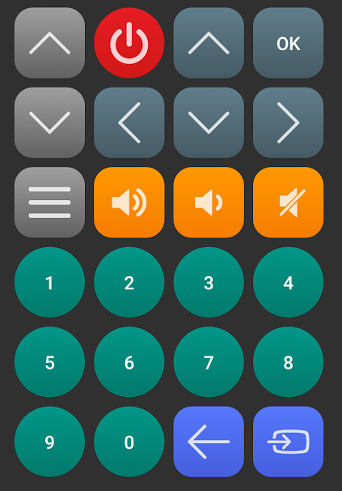

## ESP Sencor TV remote controller

Control your TV remotely with NodeMCU v3. It runs simple webserver and provides very simple API for sending control codes you can easily use it from command line like this:
```
$ curl -s 'http://esp-tvremote.example.com/?vendor=SAMSUNG&code=707030CF' | python -m json.tool
{
  "code": "OK",
  "response": "Code has been sent"
}
```

It also comes with bundled WebUI (remote controller) so controling your TV is even easier (see below for example). Every TV and every vendor comes with his own control codes for controlling the TV. You can use arduino-remote-scanner utility (also in this repo) to figure out which codes are being used by your TV. Once you have them you can simply update codes array in `src/webui/index.php` so it matches your setup. My configuration (Sencor TV, codes based on Samsung) looks like this:
```
  $codes = Array(
    'program_up' => '707048B7',
    'power' => '707030CF',
    'up' => '707042BD',
    'ok' => '7070629D',
    'program_down' => '7070C837',
    'left' => '707022DD',
    'down' => '7070C23D',
    'right' => '7070A25D',
    'menu' => '7070CD32',
    'volume_up' => '707028D7',
    'volume_down' => '7070A857',
    'volume_mute' => '7070B04F',
    '1' => '7070807F',
    '2' => '707040BF',
    '3' => '7070C03F',
    '4' => '707020DF',
    '5' => '7070A05F',
    '6' => '7070609F',
    '7' => '7070E01F',
    '8' => '707010EF',
    '9' => '7070906F',
    '0' => '707000FF',
    'return' => '7070AD52',
    'input' => '7070F00F'
  );
```

### NodeMCU v3 pinout


### Schema


### WebUI
It is located in `src/webui` directory. For using just edit the remote server variable and deploy it on some webserver.



